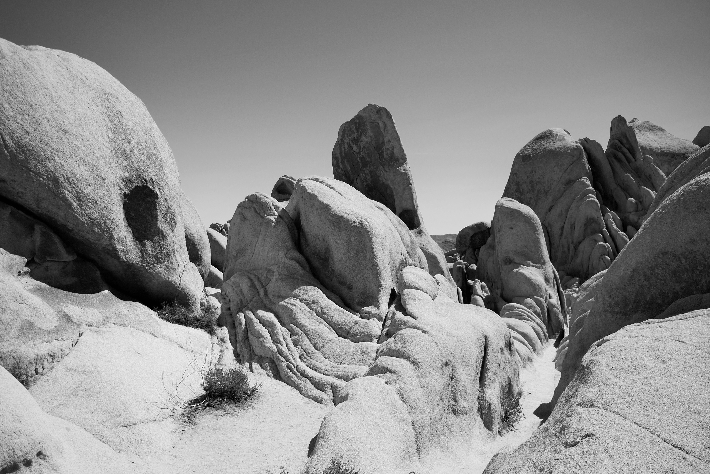

# Brandon Larrabee:evergreen_tree::sun_with_face::earth_americas:

Address:house: |    Email:computer: |        Phone:phone: | Linkedin:100:
---------------|--------------------|---------------------|--------------
555 NW 55th St. Corvallis, OR 97330 | larrabeb@oregonstate.edu | 541-555-5555 | http://www.linkedin.com/in/brandon-larrabee

## Education:
### Associates Degree | June 2016 | Oregon Coast Community College
* Major: Associates of Arts Transfer Degree
### Bachelors Degree| Expected Graduation Date: June 2019 | Oregon State
* Major: Earth Sciences with a focus in Geology
* Certificate: GIS (Geographic Information Systems)
* Additional coursework in Climate Science and Sustainability

## Experience:
#### Research Assistant | Dr. Stephen Lancaster, OSU | September 2018 - Present
* Tag, manage, and deploy over 1,600 rock samples for a sediment transport project to better model sediment transport in the fluvial systems of the Oregon coastal range
* Deploy and tune antenna frequencies used to monitor samples during transport events
* Maintain field journal of samples and reconcile with digital data to model stream flow and sediment transport

#### Vice President | OSU GeoSciences Club | March 2018 - Present
* Plan and co-lead weekly meetings for 45 members and bi-monthly fundraisers totaling $30,000 raised for an international trip
* Organize an international study abroad trip to Argentina for 30 club members
* Communicate with the scientific community at OSU to book speakers for club academic seminars

#### GIS Technician Intern | Confederated Tribes of Siletz Indians. [Website](http://www.ctsi.nsn.us) | 2018
* Manage and maintain data files and choose appropriate data, methods, and scale of analysis for each project
* Create civil, cultural, and impact maps for the community
* Design a multi-hazard mitigation plan for FEMA and prepare presentations to cupport the creation of inter-departmental action plans
* Communicate cross-functionally with the governmental body of tribe for data and input on projects

#### Trail Crew | Siskiyou Mountain Club | 2017
* Execute self-supportive trips to remote wilderness areas for extended periods of time, use maps to locate trails that have been lost to fire damage or lack of use
* Work as a team to use non-mechanized tools to remove logs and debris on over 50 miles of remote trails
* Receive certificate for 470 hrs of public service recognized by the US Forest service
* Wrote and published reports in The Mail Tribune on conservational achievements

> "Tribe follows tribe, and nation follows nation, like the waves of the sea. It is the order of nature, and regret is useless." Chief Sealth
